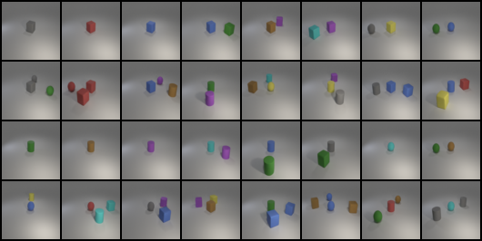
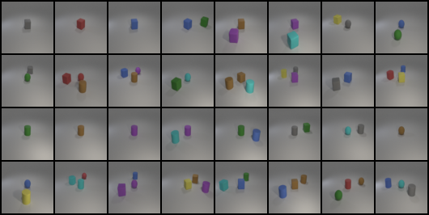
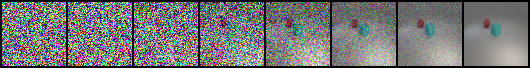
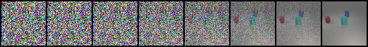

# Conditional Generative Models for i-CLEVR

A conditional image-generation project that compares **Denoising Diffusion Probabilistic Models (DDPM)** and **Flow Matching** on the i-CLEVR multi-object task.

Both methods use a 24-dimensional multi-label condition vector to generate 64×64 images, allowing their training objectives, sampling dynamics, generation quality, and runtime to be studied within one codebase.

## Methods at a glance

| Method | Learning target | Generation process | Default sampling setup |
|---|---|---|---|
| Conditional DDPM | Predict diffusion noise | Iterative denoising from Gaussian noise | DDPM or 50-step DDIM |
| Conditional Flow Matching | Predict a velocity field | Integrate a learned probability-flow ODE | 100 integration steps |

## Quick start

```bash
git clone https://github.com/junyuan881/conditional-generative-models.git
cd conditional-generative-models

python -m venv .venv
# Linux/macOS
source .venv/bin/activate
# Windows PowerShell
# .venv\Scripts\Activate.ps1

pip install -r requirements.txt
```

Place the i-CLEVR files in the following layout:

```text
data/
├── iclevr/          # Training images
├── train.json
├── test.json
├── new_test.json
└── objects.json
```

The evaluator checkpoint is stored as split files in the repository. Reassemble it once before evaluation:

```bash
python evaluator/reassemble_checkpoint.py
```

## Main workflow

| Goal | DDPM | Flow Matching |
|---|---|---|
| Train | `python src/train.py` | `python src/train_fm.py` |
| Generate test images | `python src/sample.py` | `python src/sample_fm.py` |
| Evaluate saved DDPM outputs | `python src/evaluate.py` | Evaluation scores are recorded during Flow Matching training |

All main hyperparameters and paths are centralized in [`src/config.py`](src/config.py), including the noise schedule, diffusion timesteps, DDIM sampling steps, Flow Matching integration steps, batch size, learning rate, and checkpoint locations.

## Generated examples

| Conditional DDPM | Conditional Flow Matching |
|---|---|
|  |  |

| DDPM generation process | Flow Matching generation process |
|---|---|
|  |  |

Additional generations for `test.json` and `new_test.json` are available under `outputs/` and `outputs_fm/`.

## Implementation highlights

- A conditional U-Net backbone with timestep embeddings and multi-label conditioning.
- DDPM training with configurable DDPM or DDIM sampling.
- Flow Matching training with a continuous-time velocity objective.
- Automatic best, last, and periodic checkpoint management.
- Training previews, sampling logs, generated grids, and evaluator-based accuracy measurement.
- Fixed project-level configuration to make the two methods easy to compare.

## Checkpoints and outputs

```text
checkpoints/                 # DDPM and Flow Matching model checkpoints
outputs/                     # DDPM samples, grids, and logs
outputs_fm/                  # Flow Matching samples, grids, and logs
```

By default, the scripts expect the best checkpoints defined in `src/config.py`. Train the corresponding model first or place a compatible checkpoint at that configured path before sampling.

To plot training statistics after a run:

```bash
python src/eval_training_curve.py
```

## Repository structure

```text
.
├── data/                    # i-CLEVR images and condition files
├── evaluator/               # Pretrained evaluator and checkpoint reassembly
├── outputs/                 # Included DDPM results
├── outputs_fm/              # Included Flow Matching results
├── src/
│   ├── config.py            # Shared experiment configuration
│   ├── dataset.py           # i-CLEVR datasets and condition encoding
│   ├── model.py             # Conditional U-Net
│   ├── diffusion.py         # DDPM/DDIM process
│   ├── flow_matching.py     # Flow Matching process
│   ├── train*.py            # Training entry points
│   ├── sample*.py           # Sampling entry points
│   └── evaluate.py          # Evaluator-based accuracy
└── requirements.txt
```

## References

- [Denoising Diffusion Probabilistic Models](https://arxiv.org/abs/2006.11239)
- [Denoising Diffusion Implicit Models](https://arxiv.org/abs/2010.02502)
- [Flow Matching for Generative Modeling](https://arxiv.org/abs/2210.02747)

## Author

[junyuan881](https://github.com/junyuan881)

